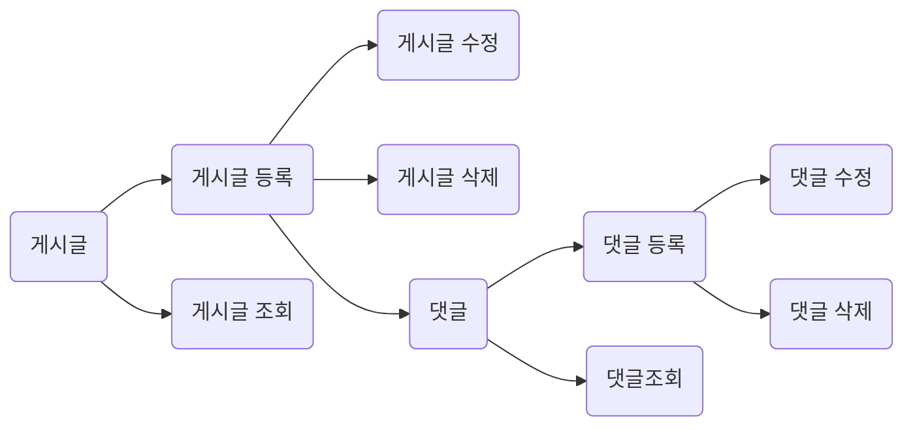

|                |HttpMethod                          |HTML                         |
|----------------|-------------------------------|-----------------------------|
|조회			 |`GET`            |'Isn't this fun?'            |
|글 등록          |`POST"`            |"Isn't this fun?"            |
|글 수정          |`PATCH`			|-- is en-dash, --- is em-dash|
|글 삭제          |`DELETE`			|-- is en-dash, --- is em-dash|

### DB Architecture
 |Board           |Comment                         |
|-------------------------------|-----------------------------|
|`(Long) boardId [PK]`            |`(Long) commentId [PK]`           	|
|(String) title           |(String) username           |
|(String) username			|(String) comment		|
|(String) content		|(Board) board [FK]	(ManyToOne)	|

### FLOW

