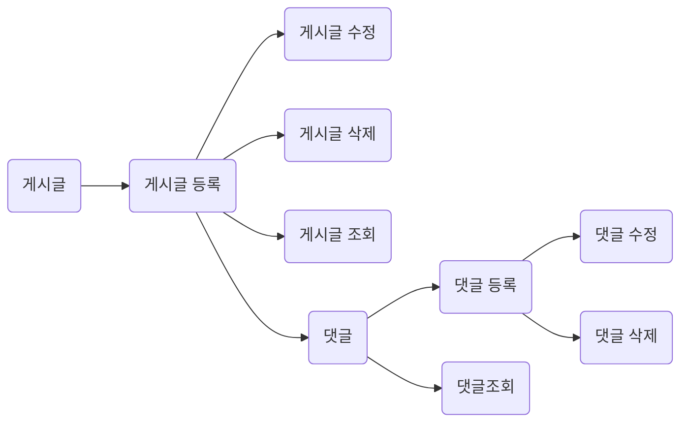

# 5기 18조 이광훈
**게시판**  만들기

## 👋프로젝트 소개 
### 제작 기간
- 제작기간 :  2022.02. 11 - 2022.02.17

	요구 조건에 맞는 게시판 만들기
1. 전체 게시글 목록 조회
    - 제목, 작성자명, 작성 날짜를 조회하기
    - 작성 날짜 기준으로 내림차순 정렬하기
2. 게시글 작성
    - 제목, 작성자명, 작성 내용을 입력하기
3. 게시글 조회
    - 제목, 작성자명, 작성 날짜, 작성 내용을 조회하기
4. 게시글 수정
    - 제목, 작성자명, 작성 내용 중 원하는 내용을 수정하기
5. 게시글 삭제
    - 원하는 게시물을 삭제하기
6. 댓글 목록 조회
    - 조회하는 게시글에 작성된 모든 댓글을 목록 형식으로 볼 수 있도록 하기
    - 작성 날짜 기준으로 내림차순 정렬하기
7. 댓글 작성
    - 댓글 내용을 비워둔 채 댓글 작성 API를 호출하면 "댓글 내용을 입력해주세요" 라는 메세지를 return하기
    - 댓글 내용을 입력하고 댓글 작성 API를 호출한 경우 작성한
 댓글을 추가하기
8. 댓글 수정
    - 댓글 내용을 비워둔 채 댓글 수정 API를 호출하면 "댓글 내용을 입력해주세요" 라는 메세지를 return하기
    - 댓글 내용을 입력하고 댓글 수정 API를 호출한 경우 작성한 댓글을 수정하기
9. 댓글 삭제
    - 원하는 댓글을 삭제하기
	
	 
	 <https://github.com/Gwang-hoon-hub/board1.git>
## Project Page (화면 및 시연)

			
## 🔨개발툴

+ Language
	+ JAVA 11

- Framework
	- SpringBoot

+ DB
	+ MySql, h2

* SERVER
	* AWS EC2 (Ubuntu)

- 사용 스택
	- Mustache
	- JPA
	- JQuery, CSS, Javascript

-	협업툴
	-	git, notion
---
### DB Architecture
 |Board           |Comment                         |
|-------------------------------|-----------------------------|
|`(Long) boardId [PK]`            |`(Long) commentId [PK]`           	|
|(String) title           |(String) username           |
|(String) username			|(String) comment		|
|(String) content		|(Board) board [FK]	(ManyToOne)	|
---
### FLOW

---
## API설계

### board(게시판)
|                |Http Method                          |API                         |
|----------------|-------------------------------|-----------------------------|
|조회			 |`GET`            |/api/boards            	|
|등록         	 |`POST"`           |/api/boards           |
|수정         	 |`PATCH`			|/api/boards{id}		|
|삭제         	 |`DELETE`			|/api/boards{id}		|

**JSON형식**
- POST(등록) : {
	"title":"글 제목",
  "username":"유저 이름",
  "content":"내용!"
}

- PATCH(수정) : {
	"title":"수정 제목",
	  "content":"내용!"
}

---
### comment(댓글)
|                |Http Method                          |API                         |
|----------------|-------------------------------|-----------------------------|
|조회			 |`GET`            |/api/comments/{게시글ID}            	|
|등록         	 |`POST"`           |/api/boards/{게시글ID}           |
|수정         	 |`PATCH`			|/api/boards{댓글ID}		|
|삭제         	 |`DELETE`			|/api/boards{댓글id}		|

**JSON형식**
- POST(등록) : {
  "username":"댓글유저이름",
  "comment":"댓글내용!"
}

- PATCH(수정) : {
	  "content":"수정내용!"
}

---
### 회고
## 🧟‍♂️이광훈  :  
>  **배움의 즐거움**
>  "첫 날" : 우와! 드디어 스프링 한다!!
>  Four Hours Later : .... 몬말인지 1도 몰으겠습니다!

강의를 들으면서는 그렇구나 그렇구나 하면서 공부를 하였는데 당연하게도 Entity, Dto ...
새로운 개념이 익숙하지 않아서인지 공부하는데 쉽지가 않았다.
하지만 강의를 다시 보고 직접 코드로 쳐보며 다른 코드들을 보면서 전체적인 흐름을 알게되었고 어떻게 설계를 하고 코드를 작성해야할지 조금의 감이 잡혔다.
또 다르게 원하는 것을 구현하기 위해서는 새로운 개념을 또 다시 익혀야 하는 생각이 들었다.
처음부터 차근 차근 쌓아서 코드를 치면 좋겠지만, 그렇지 못하기에 결국 쳐보면서 익히는 것도 나쁘지 않구나 라는 것을 알았다.
하지만 그러한 부분이 가능한 영역이 있고 그렇지 않은 영역이 있다는 것을 알았다.
특히 JPA를 사용하면서는 아... 이렇게 얉게 알고 사용할 수 있는게 아니구나 라는 것을 느꼈다.

본인은 블로그 글을 공부하는 것을 좋아하지 않고 책을 보며 천천히 설명을 위해서 해당 기능이 왜 탄생했는지 부터 공부를 하는 타입이다. 그렇지만 프로젝트를 하기위해 공부를 할 시간이 없었다. 급하게 원하는 개념을 습득하여 적용하느라 바빴다. 공부에 대한 재미를 느끼기는 했지만 누구나 그렇듯이 뒤죽박죽 내 머릿속에서 정리되지 않은 개념들이 날아 다니고 있다는 느낌을 받는다. 얼른 글로 정리하여 내 머리속 책장에 넣어야 하는데 시간이 조금만 지나도 증발해려 내것으로 만들지를 못하고 있다. 앞으로는 시간이 부족하더라도 하루에 작은 시간을 할애하여 오늘 한 공부를 정리하는 습관이 필요한다는 생각이든다.

- 예외처리
예외처리 부분을 배포파일에는 넣지 못하였다. 본인은 배포에 애를 먹어 시간의 압박을 받기 싫었기에 일단은 기본적으로 되어 있는 부분을 배포 후 예외처리에 대하여 공부를 해야겠다는 생각을 하였다.
자바에서 단순히 try-catch로 배웠던 부분을 자세히 살펴보니 ExceptionHandler를 이용하여 처리하였으며 RestControllerAdvice를 사용하는 것을 알게되었다. 커스텀 예외를 만들어 처리하는 방법...
ResponseEntity를 이용하여 reponse하는 것 또한 제대로 개념이 확립되지 않아 해당 코드에는 적요하지 못하였다.
마지막날... 몸이 좋지않아 배포만하고 쉬자라는 생각이 들었는데 뭔가 모르게 새로운 개념을 무지막지하게 집어넣고 정리하는 과정이 재밌다는 생각을 해본다. 진작에 열심히 했으면 취업했을텐데... 현타가 조금 온다...
>  
